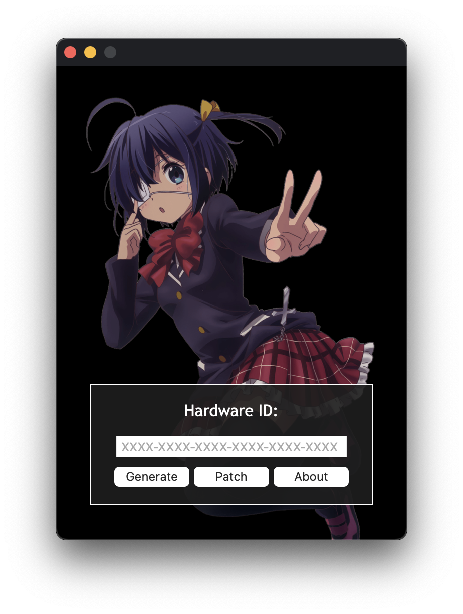
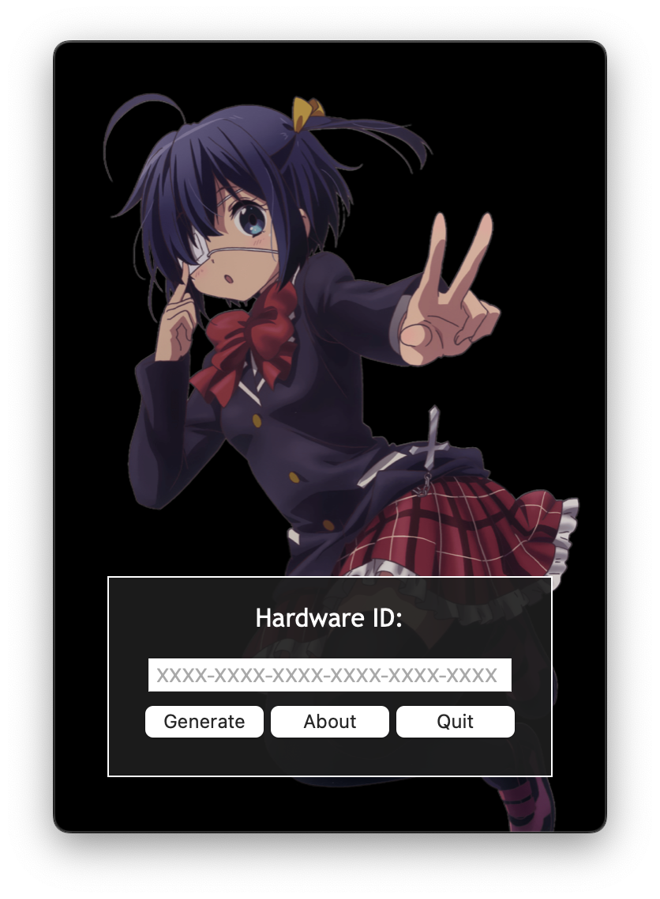
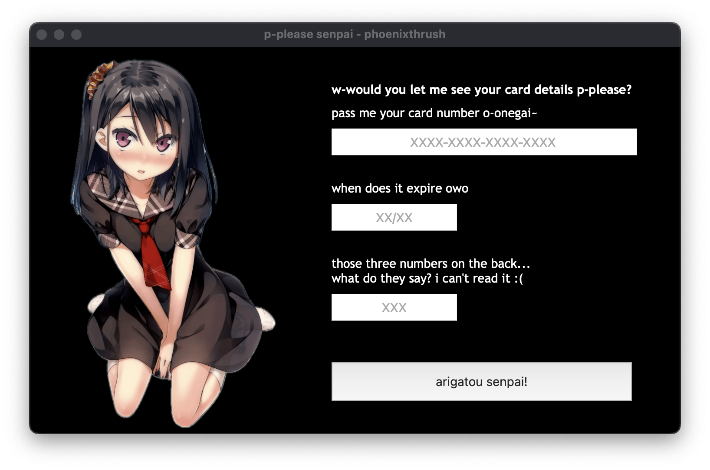

# Project README

## Overview

This repository contains the following projects:

- keygen-template: Keygen template.
- keygen-template-pywebview: Keygen template using PyWebview and Python.
- senpai-malware: Meme credit card stealer with Post Express backend.
- yuuko-bsod: Meme Blue Screen of Death (BSOD).


Clone the Webview-Projects repository with:
```
git clone https://github.com/phoenixthrush/Webview-Projects.git
```

<hr>

### Keygen Template



### Usage

```
git checkout keygen-template
make
```

<hr>

### Keygen Template PyWebview



### Usage

```
git checkout keygen-template-pywebview
```

#### MacOS, Linux
```
./compile.sh
```

#### On Windows
```
compile
```

<hr>

### Senpai Malware



### Usage

```
git checkout senpai-malware
make
```

<hr>

### Yuuko BSOD


### Usage

```
git checkout yuuko-bsod
electron main.js
```
